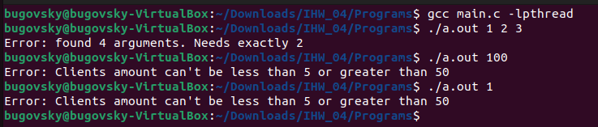
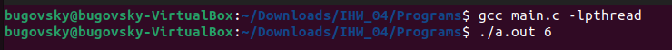

# ИДЗ № 4. Жуковский Дмитрий Романович БПИ219. Вариант 13
## Условие задачи
**Задача о гостинице-2 (умные клиенты)**  
В гостинице 10 номеров с ценой 2000 рублей, 10 номеров с ценой 4000 рублей и 5 номеров с ценой 6000
руб. Клиент, зашедший в гостиницу, обладает некоторой (случайной) суммой и получает номер по своим финансовым возможностям, если тот свободен. При наличии денег и разных по стоимости номеров он выбирает случайный номер. Если доступных по цене свободных номеров нет, клиент уходит
искать ночлег в другое место. Клиенты порождаются динамически и уничтожаются при освобождении номера или уходе из гостиницы при невозможности оплаты. Создать многопоточное приложение, моделирующее работу гостиницы.

Планируемая оценка: **6**

Ссылка на программму: [main.c](./Programs/main.c)

## Описание модели параллельных вычислений 

Модель построения - итеративный параллелизм. Используется, когда в программе есть несколько процессов или потоков, каждый из которых содержит одни или
несколько циклов. Таким образом, каждый процесс (поток) является итеративной программой. Процессы (или потоки) программы работают совместно над решением одной задачи.  Пример, связанный с разделением одного достаточно длинного цикла на несколько более коротких, и с дальнейшим их распределением по имеющимся процессорам является типичным номером итеративного параллелизма. [Описание модели с примером](http://www.softcraft.ru/edu/comparch/lect/07-parthread/multitreading.pdf) можно найти по приведенной ссылке.

В данном случае потоки представлены клиентами, каждый содержит циклы (выбор свободного номера, моделирование проживания в нем), решается общая задача - заселение номеров гостиницы и обеспечение гостиницы доходом (в чем и заключается смысл работы гостиницы).
## Входные данные.

Ввод данных осуществляется с помощью командной строки.  
Пользователь вводит только количество клиентов (через пробел после **./a.out**), которые будут выбирать номера в гостинице. Допустимый диапазон для ввода количества клиентов - от 5 до 50 (**включительно** обе границы).

**Некорректный ввод**

**Корректный ввод**

## Используемые сихропримитивы

В данной программе в качестве синхропримитивов используются мьютексы. Клиент заселяется в гостиницу, с момента его заселения до момента его окончания проживания в номере никто, кроме данного клиента, не может жить в данном номере, грубо говоря, только у клиента есть ключ, которым он может всегда запереть и отпереть дверь номера. Пока клиент платит деньги за проживание - ключ остается с клиентом,когда деньги заканчиваются - номер больше не остается за клиентом, клиент покидает гостницу, а ключ от этого номера передается тому клиенту, кто хотел проживать в данном номере (но предшественник опередил его и "закрыл" дверь номера, оставив ждать на пороге). По этой причине в качестве синхропримитива был взят мьютекс, а не, например, семафор.

## Описание поведения сущностей.

Взаимодействие сущностей следующее: сначала подготавливаются номера, крепятся таблички с номеров комнаты, устанавливается цена, подготавливаются ключи и передаются на общую стойку.  
Затем приходят сами клиенты. Каждый имеет некоторую сумму денег, не превышающую 18000 (получает случайным образом, видимо, находит), после чего хочет найти свободный номер. Сначала происходит поиск числа номеров, которые свободны и которые клиент может оплатить, затем данные номера находят и предлагают клиенту выбрать. Важно отметить: если клиенту не предложили номер, то он уходит. В противном случае клиент случайно выбирает номер, в котором проживет некоторое время.  
Может возникнуть следующая ситуация: номер не был занят, но его выбрали несколько клиентов для проживания (то есть по факту хотят проживать вдвоем в одном номере, что запрещено). В этом случае срабатывает тот факт, что существуют ключи - тот, кто забрал его первым по итогу и будет жить в номере, потому что каждый клиент первым делом закрывает номер от постороннего доступа, пока у него есть деньги для проживания. Сразу после закрытия номера на замок информация о том, что в номере кто-то живет, уже появляется у всех. Если в этот номер есть другие клиенты, то создается очередь - они будут ждать, пока клиенты перед ними не переночуют в номере столько, сколько нужно и передадут ключ далее.  
О процессе проживания: пока клиент способен заплатить за день (заплатить оговоренную стоимость номера) - он там живет. В противном случае он съезжает с номера, отпирает номер (номер становится официально никем не занятым), отдает ключ на стойку либо клиенту, который ждал, пока гостиницу покинет предыдущий.  
Клиент, проживший некоторое число дней, уезжает из гостиницы, всем предварительно сообщается, что комната, в которой он жил освободилась.  
Процесс повторяется, пока все клиенты не будут обслужены (либо покинут гостиницу)  
Когда все клиенту покинули гостиницу, пользователю показываются сведения о доходе гостиницы.

## Обобщенный алгоритм

После корректоного ввода инициализируются все элементы массива **hotel**. После того, как каждому клиенту был присвоен номер (для удобной идентификации потоков), создается поток, вызывается функция, аргументом которой является номер данного потока. Выводится информация о данном потоке и о переменной, хранящей количество рублей - она нужна для выбора тех элементов, которые будут храниться в массиве **available_rooms**. После генерируется индекс, с помощью которого будет получен элемент **available_rooms**, с которым конкретный поток будет работать. Предусмотрено решение ситуации, если несколько потоков выбрали один и тот же индекс - первый поток блокирует мьютекс, совершает необходимые операции (значение **money** уменьшается на значение **hotel[room_number].cost** на каждой итерации), и когда значение  **money** становится меньше **hotel[room_number].cost**, то мьютекс больше не блокируется данным потоком. Следующий поток может работать с данным элементом, если такая ситуация возникла. В общем случае поток всегда блокирует мьютекс, даже если он один работает с конкретным элементом.
Затем все потоки синхронизируются с помощью функции **pthread_join**, все мьютексы уничтожаются с помощью функции **pthread_mutex_destroy**, пользователю выводятся сообщения о значении переменной **income** (в чем и заключался смысл работы гостиницы).
